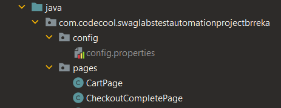

# Swag Labs Test Automation Project :shirt: :sparkles: :sunglasses:

The goal of this project was to practice automated testing using the Page-Object Model (POM). <br>
It implements automated tests for the [Swag Labs](https://www.saucedemo.com/) website, which is a simple web shop to practice testing.

The tests were written separately for the whole website functionality (buying items and paying) and login. 
The login has two kind of tests with almost identical data, to practice both parameterized tests and separate test for all of them.
Some tests are set up to fail on purpose, it is stated which in each case in the comments within the test classes.

## Technologies used
+ Java 17
+ Selenium
+ Webdrivermanager (Chromedriver)
+ Junit5
+ Junit5 params

## Installation

1. clone repository <br>
```
git clone git@github.com:BRreka/Swag-Labs-Test-Automation-Project-BRreka.git
```
2. after cloning, you need to create a config.properties file in "config" package, this method was used for hiding usernames and passwords
   + create a new package in "swaglabstestautomationprojectbrreka" and call it "config"
   + create a new file and call it "config.properties"

   
   this is how it should look like:

   

3. create the following variables:
```properties
standardUserName =
problemUserName =
lockedOutUserName =
password =
wrongPassword =
```
you can find the corresponding usernames and password on the [swag labs](https://www.saucedemo.com/) website,
for the wrong password just type in some random letters

4. in `InitPropertiesClass` utility class, change the string `config.properties path` to the path where the previously created `config.properties` file exists on your system
5. You can now run the tests